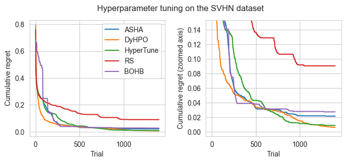

# Efficient Hyperparameter Tuning

This repository contains the code for the experimental part of the Master's thesis on Efficient Hyperparameter Tuning. The research aimed to explore and empirically compare state-of-the-art algorithms for automated hyperparameter tuning, with a focus on deep neural networks. We identified the most promising algorithms and approaches from the literature and conducted experiments on tabular benchmarks and real-world tasks, with the goal to gain insight into the performance of the algorithms on various tasks. 

This README summarizes the implementation of the experiments and provides a guide for reproducing the experiments. For the theory behind the algorithms, the exact methodology, or results please refer to the [thesis](https://dspace.cuni.cz/handle/20.500.11956/193424).

The implementation of the experiments is divided into two main components:

1. code for running the experiments,
2. code for analyzing the results.

:page_with_curl: [Experiments overview](#experiments-overview) | :arrow_forward: [Running the experiments](#running-the-experiments) | :mag_right: [Results analysis](#results-analysis)

## Experiments overview

We divide the experiments into real-world experiments and tabular experiments. For real-world experiments, we collected several public datasets, chose and implemented suitable neural networks, designed the experiments (in terms of hyperparameter search space), and finally, run the experiments.

Tabular benchmarks contain pre-computed machine learning tasks. Tabular benchmarks are a standard tool used in the development and experimental comparison of hyperparameter tuning algorithms, or more generally, black-box optimization algorithms. Nevertheless, researchers mostly test their algorithms on some subset of the benchmarks, which is why independent results we provide are valuable. 

### Real-world experiments

We carried out 7 real-world experiments on following datasets:

| Dataset      | Data type                 | Task                       | Size |
|:------------ |:-------------------------:|:--------------------------:|:----:|
| CIFAR-10     | image                     | classification             | 60k  |
| SVHN         | image                     | classification             | 70k  |
| PTB-XL       | 12-lead ECGs, time-series | multi-label classification | 22k  |
| ChestX-ray14 | image                     | multi-label classification | 112k |

For the PTB-XL dataset, pre-processing of the raw data is needed.

### Tabular experiments

We also performed experiments on these tabular benchmarks:

| Name          | Tasks used | Epochs |
| ------------- | ---------- | ------ |
| NAS-Bench-201 | 3          | 200    |
| FCNet         | 4          | 100    |
| LCBench       | 8          | 50     |

These benchmarks are included in the syne-tune library. We did not use all tasks from the LCBench. We used only the following datasets from LCBench: Fashion-MNIST, airlines, albert, christine, covertype, dionis, helena, higgs. In total, there were 15 experiments with 8 algorithms. All experiments should finish within several days of CPU time in total.

### Algorithms

We performed the comparison of these algorithms:

| Name          | Searcher     | Asynchronous | Multi-fidelity |
| ------------- | ------------ | ------------ | -------------- |
| Random Search | random       | yes          | no             |
| ASHA          | random       | yes          | yes            |
| BOHB          | model-based  | yes          | yes            |
| DEHB          | evolutionary | no           | yes            |
| HyperBand     | random       | no           | yes            |
| MOBSTER       | model-based  | yes          | yes            |
| HyperTune     | model-based  | yes          | yes            |
| DyHPO         | model-based  | yes          | yes            |

## Running the experiments

We used the syne-tune library for running the experiments and logging the results. By default, the results are logged into the syne-tune directory, which will be located in the home directory.

### How-to

1. Install Python 3.10.11

2. Install `requirements_st.txt`, preferably into a virtual environment, and activete the virtual environment

3. Prepare the dataset needed for the experiment:
   
   a) SVHN should download the data automatically,
   
   b) CIFAR-10 requires manual download from the [source](https://www.cs.toronto.edu/~kriz/cifar.html) into the `data/cifar10` directory,
   
   c) ChestX-ray14 requires manual download, follow the instructions of the dataset class, which is in the `src/datasets/torchxrayvision.py` file, and load the files into the `data/NIH directory`,
   
   d) PTB-XL requires downloading of the dataset and preprocessing. Download the dataset from [physionet.org](https://physionet.org/content/ptb-xl/1.0.3/) into the `data/ptbxl` directory. Install the wfdb library and run the src/datasets/ptbxl.py file.

4. Real-world experiments are launched using the run_hpo_synetune.py script from the repository base directory.
   
   - Example: `python src/run_hpo_synetune.py --experiment_tag "test-1" --experiment_definition "cifar_simple" --method "ASHA" --num_seeds 10 --master_seed 40 --n_workers 1`
   - Note that real-world experiments have an usual runtime in hours per one repetiton, and some could take more than a day on a GPU.

5. Tabular experiments are launched by running the the hpo_main.py code located in the src/tabular_exp directory
   
   * before launching tabular experiments, make sure you have full syne-tune instalation that contains tabular benchmarks, too. If there are any issues regarding the installation of syne-tune or tabular benchmarks, please refer to the syne-tune library documentation. 
   
   * Example: `python src/tabular_exp/hpo_main.py --experiment_tag "test-1" --benchmark "lcbench-christine" --num_seeds 30 --n_workers 1 --method 'RS'`

It is possible to re-run the experiments from the thesis by running these two scripts with different parameters. More precisely, for all the `--method` and `--experiment_definition` pairs. We used 30 seeds for tabular benchmarks, starting at the default value, and 10 seeds for the real-world experiments, starting at master_seed=40 up to 49.

The **experiment definition** names are same as the experiment names used in the thesis for the tabular benchmarks. For real-world experiments, the experiment definitons are exactly the names of the subdirectories in the `experiment_definitions` directory. List of algorithms is provided in the Algorithms section of this document.

Note that the repository also contains deprecated code that used multiple other libraries (e.g. Optuna, SMAC) instead of Syne-tune. The launching script is `run_hpo.py`, but it was not updated to the latest changes in experiment definitions. We include the requirements_ot.txt file for experimens with these libraries. 

## Results analysis

We analyze the data and plot the results in Jupyter Notebooks. For experimenting with the notebooks, you can use the syne-tune setup, but the syne-tune library, as well as many others, is not needed.

We include the collected data necessary for reproduction of the analysis and plots in the `results` directory. There is a separate file for the tabular experiments, and for the real-world experiments.

**Real-world experiments**

The notebook for analysis of the real-world experiments is located at `notebooks/real_benchmarks/real_analysis.ipynb`.

The notebook already contains code for loading the data.

**Tabular experiments**

The notebooks for analysis of tabular experiments are in the `notebooks/tabular_benchmarks` directory. We used two notebooks for the analysis - `aggregate_results.ipynb` for the statistical analysis, critical diagram, and other aggregated results, and `cumulative.ipynb` for the plots using the cumulative regret common metric. There is also the `serialize_tabular.ipynb` notebook that we used to save the collected data.

## License

All of my original work is licensed under MIT license. Several source code files are adapted from other repositiories, in which case the original license holds and it is included with the file.